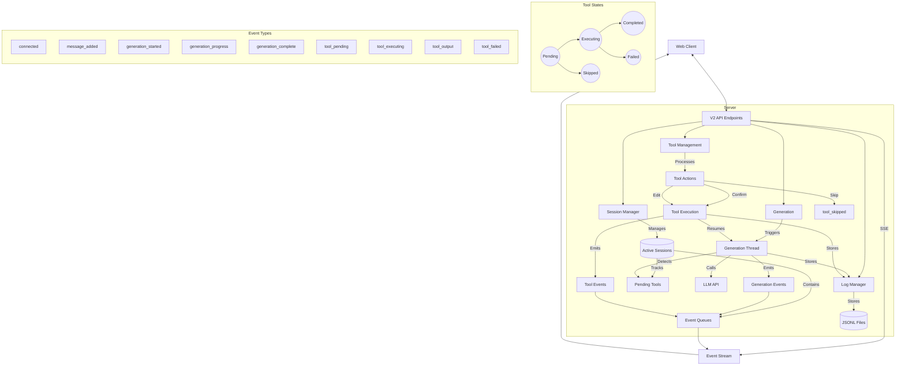
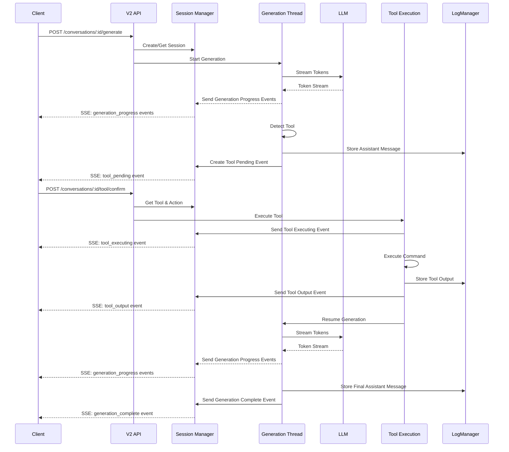

# gptme Server V2 API Architecture

## Overall Architecture

## Tool Confirmation Flow

## Key Components

### Session Management
- **SessionManager**: Central class that manages all active sessions
- **ConversationSession**: Represents a client connection to a conversation
- **Event Queues**: Track events for each session to be sent via SSE

### Tool Processing
- **Tool States**: Tools go through various states (pending, executing, completed, failed, skipped)
- **Tool Actions**: Clients can confirm, edit, skip, or auto-confirm tools
- **Tool Execution**: Happens in background threads to avoid blocking

### Event System
- **Server-Sent Events (SSE)**: Real-time event stream to clients
- **Event Types**: Various event types for different stages of processing
- **Event Queue**: Per-session queue of events to be sent to clients
