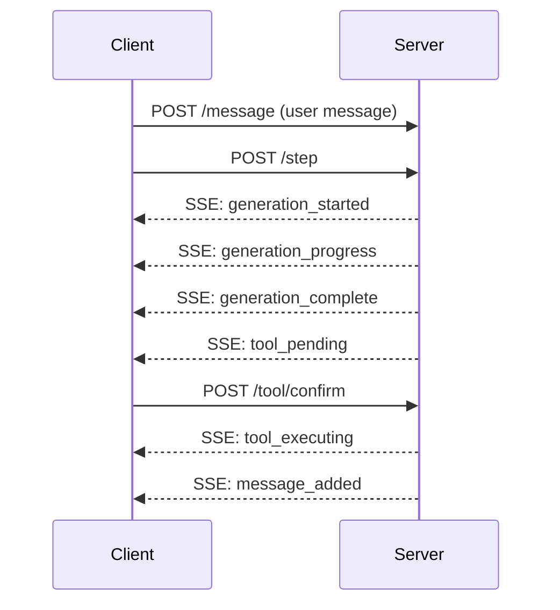
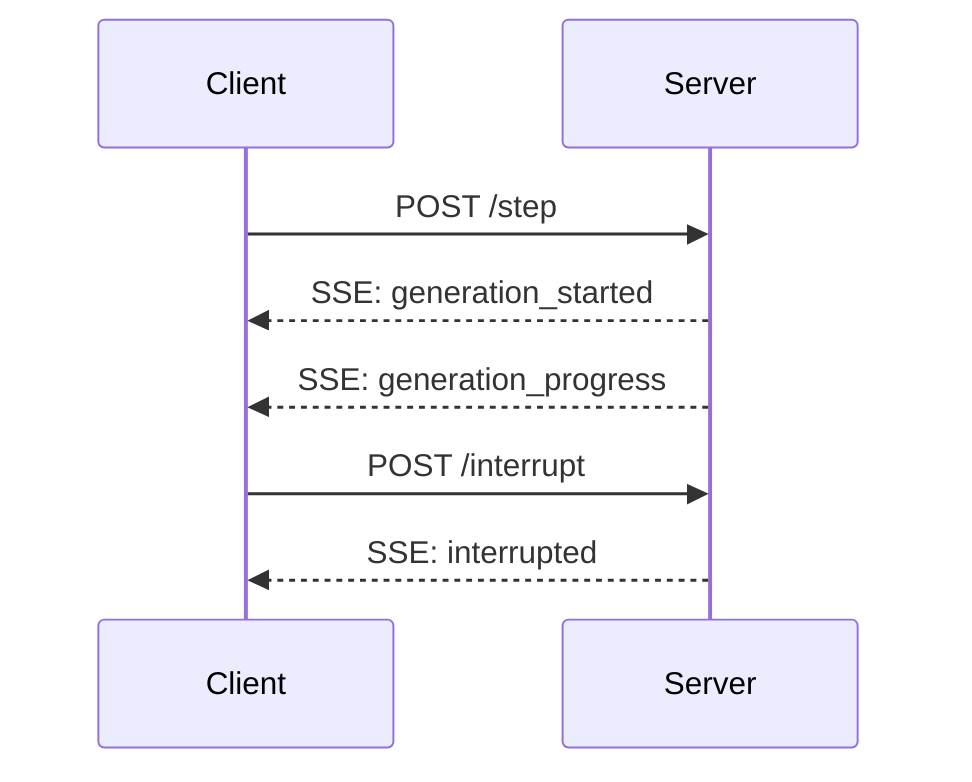

# Server API Improvements

Here we discuss the v1 conversation API and specify the improved v2 API to address the shortcomings of v1.

## Current Implementation

The current server implementation ("v1") uses a combination of REST endpoints and Server-Sent Events (SSE) for real-time updates.

### Endpoints

- GET `/api/conversations` - List conversations
- GET `/api/conversations/<id>` - Get conversation details and messages
- PUT `/api/conversations/<id>` - Create new conversation
- POST `/api/conversations/<id>` - Append message to conversation
- POST `/api/conversations/<id>/generate` - Generate response (returns SSE stream)

### Current Flow

1. Message Handling:
   - Client POSTs message to `/conversations/<id>`
   - Message is stored in conversation log

2. Generation & Tool Execution:
   - Client POSTs to `/conversations/<id>/generate`
   - Server starts SSE stream that:
     - Streams assistant response tokens
     - Detects complete tool uses
     - Executes tools automatically
     - Streams tool output
     - Auto-continues generation
     - Repeats until no more tool uses
   - Client receives all updates through single SSE connection

3. Interruption:
   - Client closes SSE connection
   - Server detects disconnection and stops generation
   - Works reliably for initial generation
   - Less reliable after tool execution

### What Works Well

- Simple, straightforward API
- Efficient streaming of tokens
- Clean separation of message storage and generation
- Basic interruption mechanism (for initial generation)
- Stateless design (no server-side session management)

### Current Issues

1. Control Flow:
   - Server drives most of the logic
   - Client has limited control over flow
   - No way to pause/resume generation
   - No tool use confirmation

2. Interruption:
   - Unreliable after tool execution
   - No clean way to interrupt specific operations
   - Server may continue processing after client disconnect

3. Tool Execution:
   - Automatic without confirmation
   - No way to reject/modify tool use
   - No progress/status updates

4. State Management:
   - No tracking of active generations
   - No session context
   - Hard to manage multiple parallel operations

## Proposed Improvements (v2)

### Session Management

Add lightweight session management to track:
- Active generations
- Pending tool executions
- Client connection status

This allows better control and cleanup of resources.

### API Endpoints

1. Event Stream:
   - GET `/api/conversations/<id>/events` - Subscribe to conversation events:
     - generation_started
     - generation_progress
     - generation_complete
     - message_added
     - tool_pending
     - tool_executing
     - error
     - connection_status

2. Actions:
   - GET `/api/conversations` - List conversations
   - GET `/api/conversations/<id>` - Get conversation
   - PUT `/api/conversations/<id>` - Create conversation
   - POST `/api/conversations/<id>` - Append message
   - POST `/api/conversations/<id>/step` - Step the conversation, starts generation
   - POST `/api/conversations/<id>/interrupt` - Stop generation
   - POST `/api/conversations/<id>/tool/confirm` - Confirm tool execution

### New Message Flow

1. Message & Generation:


2. Interruption:


### Benefits

1. Better Control:
   - Client controls flow
   - Can confirm/reject tool use
   - Reliable interruption
   - Clear operation boundaries

2. Better State Management:
   - Track active operations
   - Clean resource cleanup
   - Support multiple parallel operations

3. Improved Reliability:
   - Clear separation of events and actions
   - Better error handling
   - More predictable behavior

### Implementation Notes

1. Session Management:
   - Keep sessions lightweight
   - Auto-cleanup on disconnect
   - Support multiple clients per conversation

2. Event Stream:
   - One SSE connection per conversation
   - Clear event types
   - Proper error propagation

3. Tool Execution:
   - Wait for confirmation
   - Support timeout/auto-confirm option
   - Include tool use details in confirmation request

### Tool Confirmation Flow

1. When tool use is detected:
   ```mermaid
   sequenceDiagram
       Server-->>Client: SSE: tool_pending {id, tooluse}
       Note right of Client: Show preview to user
       Client->>Server: POST /tool/confirm {id, action}
       Note left of Server: action can be:
       Note left of Server: - confirm
       Note left of Server: - edit (with changes)
       Note left of Server: - skip
       Note left of Server: - auto (with count)
       Server-->>Client: SSE: tool_executing
       Server-->>Client: SSE: message_added
   ```

2. Confirmation Request includes:
   ```json
   {
     "id": "tool-1234",
     "tooluse": {
        "tool": "shell",
        "args": [],
        "content": "ls -la /"
     }
   }
   ```

3. Confirmation Response options:
   ```json
   {
     "id": "tool-1234",
     "action": "confirm"
   }
   ```
   ```json
   {
     "id": "tool-1234",
     "action": "edit",
     "content": "ls -la /"
   }
   ```
   ```json
   {
     "id": "tool-1234",
     "action": "skip"
   }
   ```
   ```json
   {
     "id": "tool-1234",
     "action": "auto",
     "count": 5
   }
   ```

4. Server tracks:
   - Pending confirmations
   - Auto-confirm settings
   - Modified content

4. Auto-confirm:
   - Client can enable/disable auto-confirm mode
   - Can be interrupted at any point
   - Respects tool confirmation settings
   - When enabled:
     ```mermaid
     sequenceDiagram
         Client->>Server: POST /step {auto_confirm: true}
         Note right of Client: Tools are auto-confirmed
         Server-->>Client: SSE: generation_started
         Server-->>Client: SSE: generation_progress
         Server-->>Client: SSE: generation_complete
         Server-->>Client: SSE: tool_pending
         Server-->>Client: SSE: tool_executing
         Server-->>Client: SSE: message_added
     ```
